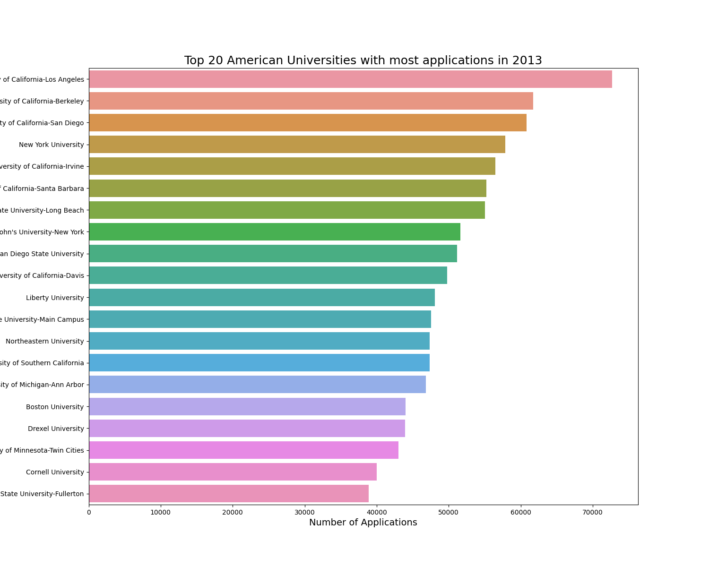
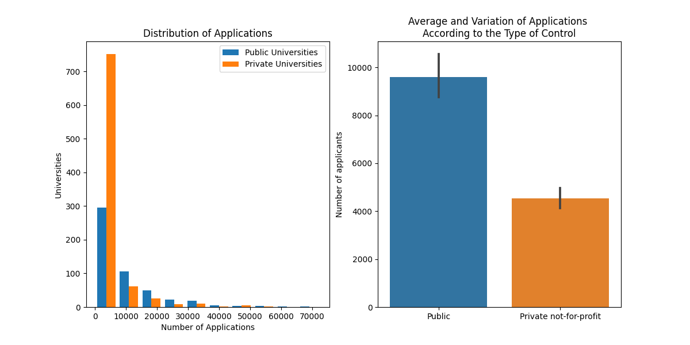
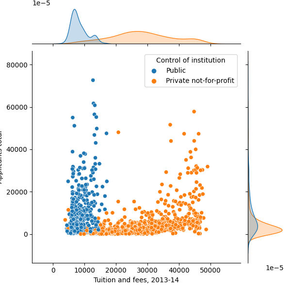
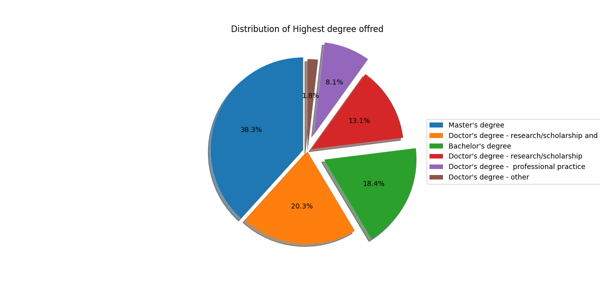
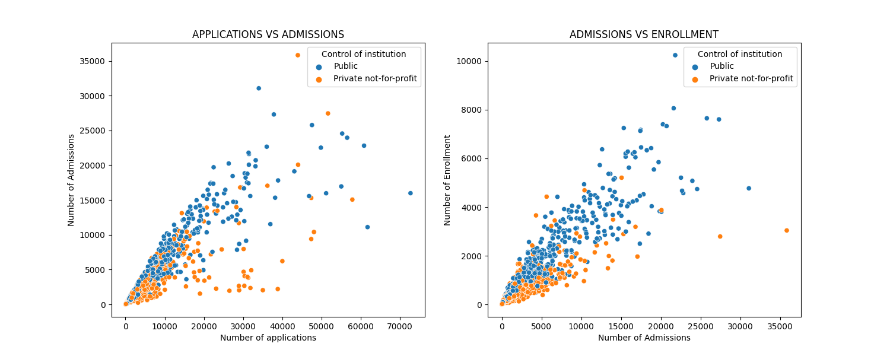

# Data_Visualization_University_Admission
Data visualization of some of the most influencing features that students consider to choose the preferred American university

## Run Locally

  

1. Clone the project

  

```bash

git clone https://github.com/sameeksha15/Data_Visualization_University_Admission.git

```

  

2. Go to the project directory

  

```bash

cd Data_Visualization_University_Admission

```

  

3. Create virtual environment

  

```bash

python -m venv venv

```

  

4. Activate virtual environment

  

- For Windows

```bash

.\venv\Scripts\activate

```

  

- For Unix

```bash

./venv/bin/activate

```

  

5. Install dependencies

  

```bash

pip install -r requirements.txt

```

  

6. Run the jupyter notebook

  

```bash

jupyter notebook .

```


## Dataset

|index|ID number|Name|year|ZIP code|Highest degree offered|County name|Longitude location of institution|Latitude location of institution|Religious affiliation|Offers Less than one year certificate|Offers One but less than two years certificate|Offers Associate&\#39;s degree|Offers Two but less than 4 years certificate|Offers Bachelor&\#39;s degree|Offers Postbaccalaureate certificate|Offers Master&\#39;s degree|Offers Post-master&\#39;s certificate|Offers Doctor&\#39;s degree - research/scholarship|Offers Doctor&\#39;s degree - professional practice|Offers Doctor&\#39;s degree - other|
|---|---|---|---|---|---|---|---|---|---|---|---|---|---|---|---|---|---|---|---|---|
|0|100654|Alabama A & M University|2013|35762|Doctor's degree - research/scholarship|Madison County|-86\.568502|34\.783368|Not applicable|Implied no|Implied no|Implied no|Implied no|Yes|Implied no|Yes|Implied no|Yes|Implied no|Implied no|
|1|100663|University of Alabama at Birmingham|2013|35294-0110|Doctor's degree - research/scholarship and professional practice|Jefferson County|-86\.80917|33\.50223|Not applicable|Implied no|Yes|Implied no|Yes|Yes|Yes|Yes|Yes|Yes|Yes|Yes|
|2|100690|Amridge University|2013|36117-3553|Doctor's degree - research/scholarship and professional practice|Montgomery County|-86\.17401|32\.362609|Churches of Christ|Implied no|Implied no|Yes|Implied no|Yes|Implied no|Yes|Implied no|Yes|Yes|Implied no|
|3|100706|University of Alabama in Huntsville|2013|35899|Doctor's degree - research/scholarship and professional practice|Madison County|-86\.63842|34\.722818|Not applicable|Yes|Implied no|Implied no|Implied no|Yes|Yes|Yes|Yes|Yes|Yes|Implied no|
|4|100724|Alabama State University|2013|36104-0271|Doctor's degree - research/scholarship and professional practice|Montgomery County|-86\.295677|32\.364317|Not applicable|Implied no|Implied no|Implied no|Implied no|Yes|Implied no|Yes|Yes|Yes|Yes|Implied no|


## OUTPUT 

- Plot for "Top 20 American Universities in 2013"
<br/>

[]()

<br/>
<br/>

- Plot for "Distribution of number of applications"
<br/>

[]()

<br/>
<br/>


- Plot for "Tuition and fees depending on the control of institution"
<br/>

[]()

<br/>
<br/>

- Pie Chart for "Distribution of highest degree offered by the institution"
<br/>

[]()

<br/>
<br/>

- Plot for "Correlation between Number of applications and enrollment rate"
<br/>

[]()

<br/>
<br/>


